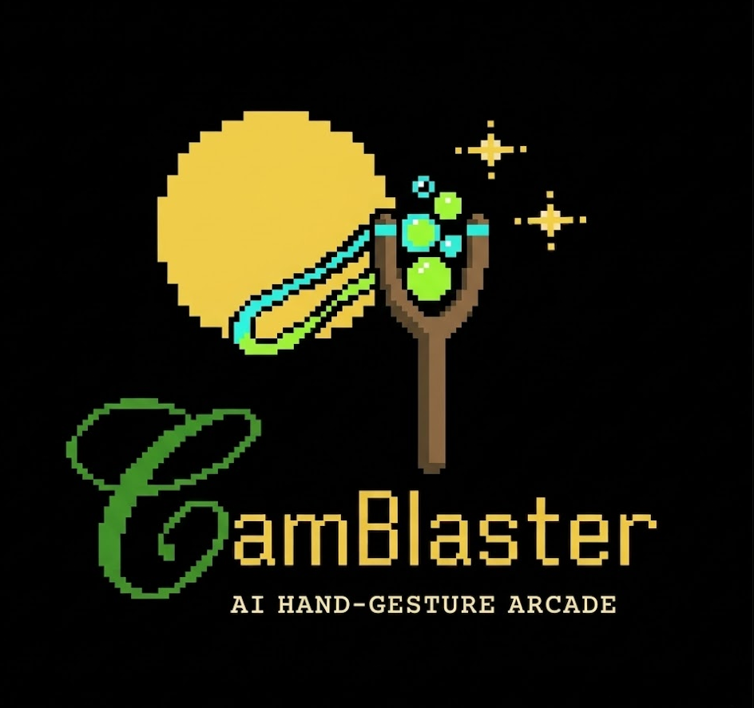

  

<h1 align="center">CamBlaster</h1>

  <b>AI Hand-Gesture Arcade — Powered by Google Gemini</b>

  <a href="https://gemini-slingshot-one.vercel.app">🎮 Play Live</a> •
  <a href="#tech-stack">Tech Stack</a> •
  <a href="#getting-started">Get Started</a>

---

## 🎮 How to Play
1. **Allow Camera Access**: The game requires webcam access to track your hand.
2. **Pinch to Aim**: Pinch your index finger and thumb together to grab the slingshot.
3. **Pull & Release**: Pull back your hand to charge the shot, then release the pinch to fire!
4. **Match Colors**: Match 3 or more bubbles of the same color to pop them.
5. **AI Strategy**: The game uses Google Gemini 1.5 Flash to analyze the board and suggest the best shots (indicated by the specialized targeting line).

## 🚀 Features
- **Hand Tracking**: Powered by MediaPipe Hands for real-time gesture control.
- **AI Analysis**: Google Gemini Multimodal API analyzes the game board for strategic hints.
- **Visuals**: Vibrant Cyan & Electric Lime aesthetic with particle effects.
- **Scoring**: Combo systems, high scores, and difficulty levels.

## 🛠️ Built With
- **Frontend**: React + Vite + TypeScript
- **Styling**: Tailwind CSS
- **AI/ML**: MediaPipe Hands, Google Gemini API
- **Backend/Auth**: Firebase

## 👨‍💻 Author
Made by **Aryan-algorithms** | 2026

## 📜 License
Apache-2.0
